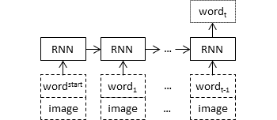
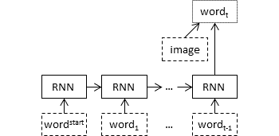

In this tutorial, we are going to use Convolutional Neural Networks for image description.

The main notebook file is [encoder-decoder_image_description.ipynb](encoder-decoder_image_description.ipynb).

You can run the tutorial in Google Colab:
https://colab.research.google.com/github/mmehdig/apl-esslli-19-material/blob/master/2-language-models-part2/encoder-decoder_image_description.ipynb

The architecture of the simple model is as follows:



You can change the model and try other architectures as well.

(optional) Additionally, you can take a look at how the simple captioning model is trained and defined [train_flickr30k_captions.ipynb](train_flickr30k_captions.ipynb).
In order, to train a new model on Flickr 30K dataset you need to download and process images separately. 

You can also try other solutions for fusing word embeddings with visual features, for example:




-----

The graphs are from Tanti et al. (2018):
```
@article{tanti2018put,
  title={Where to put the image in an image caption generator},
  author={Tanti, Marc and Gatt, Albert and Camilleri, Kenneth P},
  journal={Natural Language Engineering},
  volume={24},
  number={3},
  pages={467--489},
  year={2018},
  publisher={Cambridge University Press}
}
```
